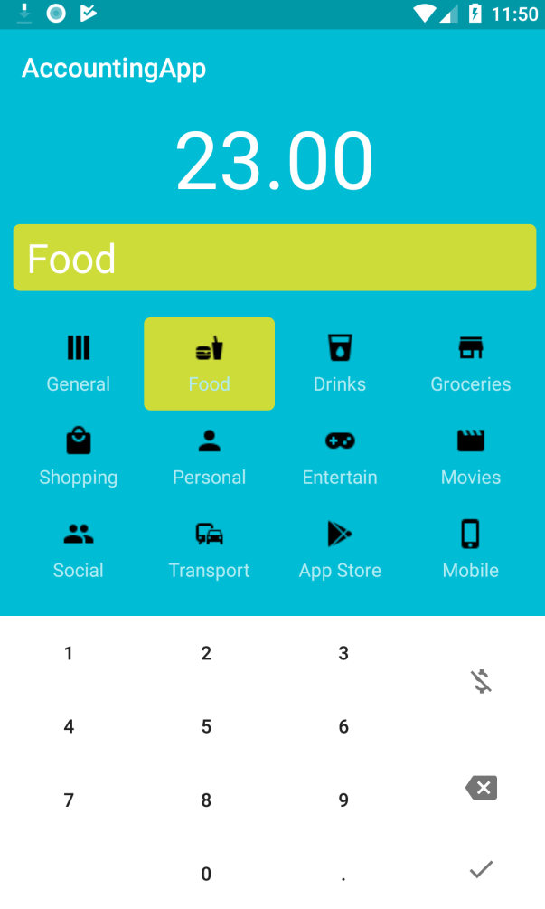
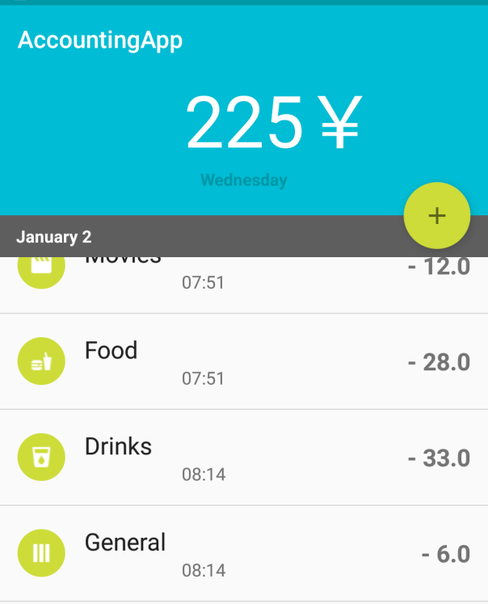

## Pocket book

### java版本：1.7

### 实现了登录，保密，与账目信息的增删查改。

### 以及账目数据的可视化

### 支持通过月份、星期、日期、来查看账目数据与线管图像

### 使用插件[ticker](https://github.com/robinhood/ticker)

### 其主要作用是在账目数据变化时，提供优雅地滚动过渡动画。

# Pocket-book
